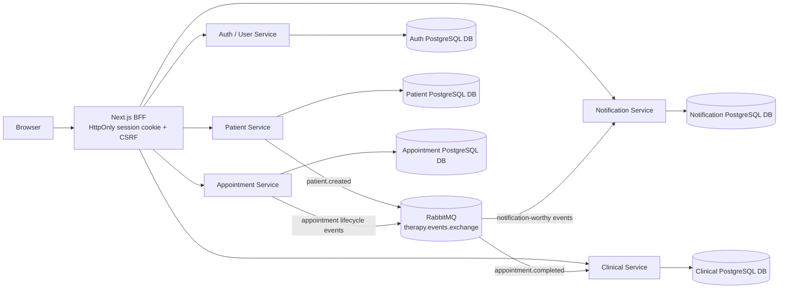

# ClinicFlow

> **Active development — portfolio prototype**
>
> ClinicFlow is a working cloud-native therapy-practice platform prototype. It
> is being developed to demonstrate software architecture, backend engineering,
> event-driven communication, security boundaries, observability, testing, and
> delivery practices. It is **not production-ready clinical software** and must
> not be used with real patient data.

ClinicFlow gives psychologists a local workspace for managing patients,
appointments, clinical cases, care plans, session records, practice settings,
and simulated notifications. The project is intentionally being developed in
public as an evolving engineering portfolio: the current vertical slice is
usable locally, while further hardening and delivery work remains tracked in
the roadmap.

## At a glance

| Area | Current state |
| --- | --- |
| Product scope | Cloud-native therapy-practice MVP / portfolio prototype |
| Application shape | Next.js BFF plus five Spring Boot services |
| Local entry point | Docker Compose at `http://localhost:3000` |
| Messaging | RabbitMQ topic exchange with version-controlled event contracts |
| Persistence | PostgreSQL database per service with Flyway migrations |
| Kubernetes | Helm-packaged Docker Desktop Kubernetes deployment |
| Observability | Spring Actuator, Micrometer, Prometheus, Grafana, and structured logs |
| Quality approach | Unit, MVC slice, persistence, messaging, API, and Playwright tests |
| Delivery status | CI and independent local release packaging; production CD is not implemented |

## Why this project exists

The goal is not to claim a complete commercial clinical platform. The goal is
to build a credible, security-conscious vertical slice and make the important
engineering decisions visible:

- service boundaries follow business capabilities;
- each service owns its persistence model and migrations;
- domain logic is kept independent from frameworks and infrastructure;
- asynchronous workflows use explicit event contracts;
- browser sessions are handled by a same-origin backend-for-frontend (BFF);
- security, observability, testing, and delivery are treated as part of the
  system rather than afterthoughts.

## Current capabilities

The current local application supports:

- registration and login with short-lived asymmetric JWTs;
- role-aware psychologist, patient, and administrator flows;
- psychologist patient management, including consent and emergency-contact
  data;
- appointment scheduling, rescheduling, cancellation, completion, and history;
- psychologist practice profiles, clinical cases, care plans, care goals, and
  session records;
- patient clinical-history views protected by ownership checks;
- RabbitMQ event publication and consumption;
- simulated notification delivery and notification history;
- service health, metrics, and an administrator-facing system view;
- Docker Compose development and a local Helm/Kubernetes deployment model.

The project deliberately does not include payments, video calls, real-time chat,
document uploads, prescriptions, diagnostics, clinical recommendations,
emergency psychological systems, calendar integrations, or real notification
providers.

## Architecture



### Service responsibilities

| Component | Responsibility | Example boundary |
| --- | --- | --- |
| `auth-service` | Registration, password authentication, user profiles, roles, and JWT issuance | `POST /auth/login`, `GET /users/me` |
| `patient-service` | Psychologist-owned patient records and patient lifecycle events | `POST /patients`, `GET /patients` |
| `appointment-service` | Appointment lifecycle and appointment events | `POST /appointments`, `PATCH /appointments/{id}/reschedule` |
| `clinical-service` | Practice profiles, clinical cases, care plans, and session records | `POST /clinical-cases`, `POST /clinical-cases/{id}/session-records` |
| `notification-service` | RabbitMQ consumers, simulated delivery, history, and event metrics | `GET /notifications` |
| `frontend` | Next.js App Router application and same-origin BFF | Browser-facing `/api/*` routes |
| `event-contracts` | Shared, explicit event payload contracts and examples | Patient and appointment events |

Each backend service has its own domain, application, adapter, and
infrastructure layers. Cross-service data is not read through shared database
tables. Clinical details remain in the clinical service and are not published
through RabbitMQ.

## Technology and engineering practices

- Java 21 and Spring Boot 3.5.16.
- Maven multi-module monorepo with the Maven Wrapper.
- Next.js 16.2.11, React 19.2.4, and TypeScript 5 in the frontend.
- Clean Architecture and explicit inbound/outbound ports per service.
- MapStruct mappers at REST, application, persistence, and messaging
  boundaries.
- PostgreSQL 16 with Flyway migrations and database-per-service ownership.
- RabbitMQ 4 with a topic exchange and explicit routing keys.
- Docker images and Docker Compose for the complete local stack.
- Helm 4 packaging for independently managed application releases on Docker
  Desktop Kubernetes.
- Spring Actuator, Micrometer, ECS-style JSON logging, Prometheus, Grafana,
  ServiceMonitors, and Kubernetes NetworkPolicies.
- Service-scoped Jenkins CI pipelines for deployable components, alongside a
  shared system-validation pipeline. These pipelines are CI only: they do not
  publish images, promote artifacts, or deploy an environment.

## Security position

Security is treated as an engineering baseline for the prototype, not as a
compliance or certification claim.

- Passwords are hashed with BCrypt and login errors are deliberately generic.
- Auth Service signs short-lived JWTs with an RSA private key; resource
  services validate tokens with the public key.
- The Next.js BFF keeps the access token in an HttpOnly cookie and requires a
  double-submit CSRF token for mutating same-origin requests.
- Role checks are applied at HTTP boundaries, while ownership and business
  authorization remain in application services.
- Notification history is scoped to the owning psychologist where appropriate.
- Request validation and sanitized problem-style error responses are tested.
- Development keys and generated artifacts are ignored by Git.
- Kubernetes uses default-deny and workload-specific NetworkPolicies for the
  documented local traffic flows.

The project uses OWASP ASVS Level 2 as an implementation baseline. This does
not mean that ClinicFlow is certified, suitable for clinical use, or ready for
an internet-facing deployment. TLS termination, HSTS, external secret
management, managed persistence, image scanning, SBOM generation, and a
production ingress remain future work.

See the [ASVS implementation mapping](docs/security/asvs-l2-mapping.md).

## Run the local demo

### Prerequisites

- Docker Desktop or Docker Engine with Compose.
- PowerShell 7 for the repository scripts.
- OpenSSL available in the shell path.
- Java 21 and Node.js 24/npm 11 for host-side development and validation.

### Start the complete stack

From the repository root:

```powershell
.\scripts\generate-dev-jwt-keys.ps1
docker compose up --build
```

Open [http://localhost:3000](http://localhost:3000). The Compose setup starts
PostgreSQL, RabbitMQ, all five backend services, and the frontend. It also
loads deterministic demo data so the main role-specific screens can be
explored immediately.

The local demo accounts are:

| Role | Email |
| --- | --- |
| Administrator | `admin@demo.clinicflow.local` |
| Psychologist | `sofia.almeida@demo.clinicflow.local` |
| Psychologist | `miguel.santos@demo.clinicflow.local` |
| Patient | `ana.martins@demo.clinicflow.local` |
| Patient | `joao.ferreira@demo.clinicflow.local` |

The password for all demo accounts is `ClinicFlowDemo!2026`. These credentials
and the `clinicflow` PostgreSQL/RabbitMQ credentials are intentionally for the
isolated local demo only. Do not reuse them in a shared, hosted, or production
environment.

Useful local endpoints:

| Component | URL |
| --- | --- |
| Frontend | `http://localhost:3000` |
| Auth Service | `http://localhost:8081` |
| Patient Service | `http://localhost:8082` |
| Appointment Service | `http://localhost:8083` |
| Notification Service | `http://localhost:8084` |
| Clinical Service | `http://localhost:8085` |
| RabbitMQ Management | `http://localhost:15672` |

For the full local-development guide, including environment variables,
frontend-only development, smoke-flow steps, and cleanup, see
[docs/development/local-development.md](docs/development/local-development.md).

## Validate changes

### Backend

Fast unit and Spring MVC slice tests:

```powershell
.\mvnw.cmd test
```

Complete backend verification, including Testcontainers integration tests and
coverage:

```powershell
.\mvnw.cmd clean verify
```

Integration verification requires Docker for PostgreSQL and RabbitMQ
Testcontainers.

Mutation testing for domain and application logic uses a separate Maven
profile:

```powershell
.\mvnw.cmd -pl event-contracts -am -DskipTests install
.\mvnw.cmd -Pmutation org.pitest:pitest-maven:mutationCoverage
```

### Frontend

```powershell
cd frontend
npm ci
npm run typecheck
npm run lint
npm run build
npm run test:unit
npm run test:e2e
```

The Playwright smoke flow covers registration, patient creation, appointment
scheduling, clinical workflow, notifications, and the system health view. It
expects the local stack to be available or starts the frontend development
server according to the Playwright configuration.

### Repository and platform checks

The repository includes PowerShell validation scripts for hygiene, backend
quality, frontend quality, Compose/Playwright validation, image builds, and
Helm rendering/schema validation. `Jenkinsfile.system` owns cross-service
validation, while the service pipelines own component-level CI.

See the [testing strategy](docs/development/testing-strategy.md) for suite
conventions, coverage thresholds, reports, and CI details.

## Kubernetes and observability

Kubernetes is currently a local Docker Desktop target intended to demonstrate
packaging, probes, NetworkPolicies, metrics, dashboards, and independent
release boundaries. It is not a production deployment model.

Deploy the local Kubernetes stack from the repository root:

```powershell
.\scripts\deploy-local-kubernetes.ps1
```

The deployment creates local JWT material when needed, builds local images,
installs the observability and shared platform releases, and upgrades the
frontend plus five application releases. A single application can be upgraded
with, for example:

```powershell
.\scripts\deploy-local-kubernetes.ps1 -Component Patient
```

Prometheus and Grafana are accessed through port-forwarding rather than public
Ingress or NodePort exposure. The detailed commands and troubleshooting notes
are in [Kubernetes and Observability](docs/infrastructure/kubernetes-observability.md).

The architecture and release decisions are documented in the
[architecture decision records](docs/architecture/architectural-decisions.md)
and the [delivery modernization work packages](docs/architecture/delivery-modernization/README.md).

## Roadmap and current status

The project is currently under active development. Open work, priorities, and
their current status are maintained in the repository's Issues section.

## Repository guide

```text
auth-service/          Authentication, users, roles, and JWT issuance
patient-service/       Patient management and patient events
appointment-service/   Appointment lifecycle and appointment events
clinical-service/      Practice profiles and clinical workflow
notification-service/  Event consumers and simulated notifications
event-contracts/       Shared event contract examples and tests
frontend/              Next.js application and BFF
deploy/helm/           Platform, observability, service, and frontend charts
deploy/jenkins/        Local Jenkins controller and agent setup
docker/                PostgreSQL initialization and bootstrap scripts
docs/                  Architecture, security, delivery, testing, and operations
scripts/               Local development, deployment, and CI validation scripts
```

Important references:

- [Project overview and functional requirements](Project_Overview.md)
- [Local development guide](docs/development/local-development.md)
- [Testing strategy](docs/development/testing-strategy.md)
- [Architecture decisions](docs/architecture/architectural-decisions.md)
- [Security mapping](docs/security/asvs-l2-mapping.md)
- [Kubernetes and observability](docs/infrastructure/kubernetes-observability.md)
- [Frontend notes](frontend/README.md)

## Data and usage disclaimer

ClinicFlow is an engineering prototype for demonstration and learning. It is
not medical advice, a clinical decision-support system, an emergency service,
or a substitute for appropriately regulated software. Use only synthetic data
in local development. Do not connect it to real patients, clinical records,
production credentials, or an internet-facing environment without completing
the outstanding security, privacy, infrastructure, and operational work.
